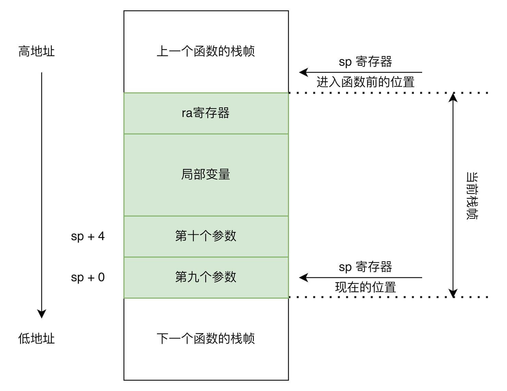

# Lv8.1. 函数定义和调用

本节新增/变更的语法规范如下:

```ebnf
CompUnit    ::= [CompUnit] FuncDef;

FuncDef     ::= FuncType IDENT "(" [FuncFParams] ")" Block;
FuncType    ::= "void" | "int";
FuncFParams ::= FuncFParam {"," FuncFParam};
FuncFParam  ::= BType IDENT;

UnaryExp    ::= ...
              | IDENT "(" [FuncRParams] ")"
              | ...;
FuncRParams ::= Exp {"," Exp};
```

## 一个例子

```c
int half(int x) {
  return x / 2;
}

void f() {}

int main() {
  f();
  return half(10);
}
```

## 词法/语法分析

本节新增了关键字 `void`, 你需要修改你的 lexer 来支持它们. 同时, 你需要针对发生变化的语法规则, 例如 `CompUnit`, `FuncDef` 等, 设计新的 AST, 并更新你的 parser 实现.

## 语义分析

本节 `CompUnit` 的定义发生了变化, 其允许多个不同的函数同时存在于全局范围内. 为了避免函数之间的重名, 你可以把全局范围内所有的函数 (包括之后章节中会出现的全局变量) 都放在同一个作用域内, 即全局作用域. 全局作用域应该位于所有局部作用域的外层, 你可以修改你的符号表使其支持这一特性.

## IR 生成

在 Koopa IR 中, 你可以像定义 `@main` 函数一样, 定义其他的函数. 如果函数有参数, 可以直接在函数名之后的括号内写明参数名称和类型. 使用上, 函数的形式参数变量和函数内的其他变量并无区别.

Koopa IR 中, 使用 `call 函数名(参数, ...)` 指令可以完成一次函数调用. `call` 指令是否具备返回值, 以及具备什么类型的返回值, 取决于指令所调用的函数的具体类型. 如果 `call` 指令不具备返回值, 则不能写为 `%v = call ...` 的形式.

对于返回值类型为 `void` 的函数, 定义函数时省略类型标注, 函数内使用 `ret` 指令时不需要附带返回值. 即, 函数需要返回时, 直接写 `ret` 即可.

示例程序生成的 Koopa IR 为:

```koopa
fun @half(@x: i32): i32 {
%entry:
  %x = alloc i32
  store @x, %x
  %0 = load %x
  %1 = div %0, 2
  ret %1
}

fun @f() {
%entry:
  ret
}

fun @main(): i32 {
%entry:
  call @f()
  %0 = call @half(10)
  ret %0
}
```

!> 本章引入了全局符号定义. 在 Koopa IR 中, 全局的符号不能和其他全局符号同名, 局部的符号 (位于函数内部的符号) 不能和其他全局符号以及局部符号同名. 上述规则对具名符号和临时符号都适用.

你可能会注意到, 在 `@half` 函数中, 我们为参数 `@x` 又单独分配了一块名为 `%x` 的内存空间. 直接使用 `@x` 不行吗? 比如像这样:

```koopa
fun @half(@x: i32): i32 {
%entry:
  %0 = div @x, 2
  ret %0
}
```

可以的, 完全正确! 但此处采取了看起来更繁琐的做法, 是为了方便目标代码生成部分的处理. 否则, 目标代码生成必须做复杂处理, 或者直接生成出错误的代码.

## 目标代码生成

目标代码生成部分无非涉及以下几个问题, 即, 在 RISC-V 汇编中:

* 如何定义函数?
* 如何调用函数?
* 如何传递/接收函数参数?
* 如何传递/接收返回值, 以及从函数中返回?

这些问题的基础, 都和 RISC-V 的调用约定, 以及栈帧的构造 (这其实也是调用约定的一部分) 相关. 建议你先回顾一下 [Lv4.2 中的相关内容](/lv4-const-n-var/var-n-assign?id=目标代码生成).

### 函数的调用和返回

RISC-V 中, `call` 和 `ret` 伪指令可以实现函数的调用和返回——确切的说, 其中的 `jalr` 指令实现了函数调用和返回中的关键操作: 跳转和保存返回地址. 当然, 从这两条指令的含义中我们得知:

1. 在汇编层面, “函数调用和返回” 并不包括参数和返回值的传递.
2. 函数的返回地址保存在寄存器 `ra` 中.

第二点告诉我们, 一旦一个函数中还会调用其他函数, 这个函数 (或另外的函数) 就必须保存/恢复自己的 `ra` 寄存器. 比如本节示例中的 `main` 函数调用了 `half` 函数和 `f` 函数, `main` 必须保存自己的 `ra`. 否则在调用其他函数时, `call` 指令会修改 `ra` 的值, 而 `main` 在执行 `ret` 时, `ra` 的值就不再是进入 `main` 时的值了, `main` 就无法返回到正确的位置, 只能在自己的函数体里无限循环.

把函数之间的调用关系想象成一个图 (即调用图, [call graph](https://en.wikipedia.org/wiki/Call_graph)), 那么一个永远不会调用其他函数的函数就位于图中的叶子结点, 我们把这种函数称为叶子函数 ([leaf function](https://en.wikipedia.org/wiki/Leaf_subroutine)). 与之相对的, 还有非叶子函数.

在 RISC-V 中, 非叶子函数通常需要在 prologue 中将自己的 `ra` 寄存器保存到栈帧中. 在 epilogue 中, 非叶子函数需要先从栈帧中恢复 `ra` 寄存器, 之后才能执行 `ret` 指令. 叶子函数可以不必进行上述操作——当然进行了也不会出问题, 只是会做一些无用功导致性能变差.

### 传递/接收参数

RISC-V 有 8 个寄存器: `a0`-`a7`, 它们专门用来在函数调用时传递函数的非浮点参数, 前提是函数参数可以被塞进这些寄存器 (在本课程中不会出现塞不进去的情况, 指所有函数参数数据的位宽均小于等于 32 位). 函数的前 8 个参数必须按照从前到后的顺序依次放入 `a0` 到 `a7` 寄存器.

那你可能会问:

> “如果函数参数超过 8 个怎么办?”

注意: 你在课程中实现的编译器必须考虑函数参数超过 8 个的情况, 同时我们提供的测试用例中也会涉及针对该情况的测试.

对于这种情况, RISC-V 的调用约定规定, 超出部分的参数必须放在 “调用者” 函数 (caller, 也就是调用超 8 个参数函数的那个函数) 的栈帧中. 具体来说, 第 9 个参数放在 `sp + 0` 的位置, 后续参数按照从前到后的顺序依次放在 `sp + 4` 及之后——当然, 这是建立在你传的参数的长度都是 32 位的基础上来讨论的. 具体如图所示:



所以, 函数在建立自己栈帧的时候, 必须给函数内所有超 8 个参数的函数调用留出足够大的空间, 来传递函数参数.

> “为什么这么麻烦啊?”

没办法, 写编译器就是一个入乡随俗的过程. 编译器必须得依着目标指令系统的性子, 生成格式正确的指令, 同时按照约定的规矩处理栈帧啊, 传参啊, 这啊那啊的一大堆破事. 所以, 下次编译器给你写的代码报错的时候, 记得好好哄哄编译器, 人家也不容易. 报警告的时候也得哄, 因为[警告和错误一样重要](/preface/facing-problems?id=面对问题完成实践的态度)!

> “写编译器的程序员也不容易啊, 那你能好好哄哄我吗?”

——哄……哄也不是不可以啦……

写文档的助教也不容易, 你能哄……哎, 人呢? 怎么跑了?

### 关于寄存器

目前对于大部分的 Koopa IR 变量, 包括 `alloc` 分配的内存, 以及其他指令的返回值, 你的编译器会把它们全部保存在栈帧里, 而不是寄存器上. 即便用到寄存器, 也只是诸如 `t0`-`t6` 的临时寄存器. 你有没有想过这些寄存器为什么叫 “临时寄存器”? 临时寄存器的含义又是什么?

RISC-V 的 [ABI](https://en.wikipedia.org/wiki/Application_binary_interface) 中, 32 个整数寄存器的名称和含义如下表所示:

| 寄存器    | ABI 名称  | 描述                | 保存者    |
| -         | -         | -                   | -         |
| `x0`      | `zero`    | 恒为 0              | N/A       |
| `x1`      | `ra`      | 返回地址            | 调用者    |
| `x2`      | `sp`      | 栈指针              | 被调用者  |
| `x3`      | `gp`      | 全局指针            | N/A       |
| `x4`      | `tp`      | 线程指针            | N/A       |
| `x5`      | `t0`      | 临时/备用链接寄存器 | 调用者    |
| `x6-7`    | `t1-2`    | 临时寄存器          | 调用者    |
| `x8`      | `s0`/`fp` | 保存寄存器/帧指针   | 被调用者  |
| `x9`      | `s1`      | 保存寄存器          | 被调用者  |
| `x10-11`  | `a0-1`    | 函数参数/返回值     | 调用者    |
| `x12-17`  | `a2-7`    | 函数参数            | 调用者    |
| `x18-27`  | `s2-11`   | 保存寄存器          | 被调用者  |
| `x28-31`  | `t3-6`    | 临时寄存器          | 调用者    |

ABI 中明确了 32 个整数寄存器的作用. 这些寄存器中, `x0` 硬件上无法被修改, `x2`-`x4` 软件上一旦被修改程序就会出问题, 剩下所有的寄存器可以用来随便存数据. 其中, `t0` 到 `t6` 这七个寄存器为临时寄存器, 这些寄存器是由 “调用者” 保存的, 即 “caller-saved”, 所以它们很适合用来存储临时数据.

在 ABI (或者说调用约定) 中, 保存寄存器的操作可以由两方来进行: 一方是负责调用函数的那个函数, 另一方是被调用的那个函数. 前者负责保存的寄存器叫 “调用者保存的寄存器” (caller-saved registers), 后者负责的叫 “被调用者保存的寄存器” (callee-saved register).

你可能听得一头雾水, 我换种说法: “调用者保存” 的寄存器, 在 “被调用” 的函数中可以随便乱写. 因为 ABI 规定这些寄存器已经被 “调用这个函数的函数” 保存在它自己的栈帧里了, “被调用” 的函数不需要操心怎么保存他们. 反之, 如果一个函数需要使用某些 “被调用者保存” 的寄存器, 在这个函数进入的时候 (即 prologue 中), 这个函数就必须把它要使用的这些寄存器保存一遍. 而对于这个函数的调用者, 在它看来, 调用函数前后, 所有 “被调用者保存” 的寄存器的内容都是不会发生变化的.

比如, 对于如下这个程序:

```
  li t0, 42
  call func
  addi t0, t0, 1
```

我们不能保证, `addi` 指令执行完成后, `t0` 一定是 43. 因为根据 ABI, `func` 不负责保存 `t0` 寄存器的值, 它可以往里随便写数据. 于是, `call` 指令执行完成后, `t0` 的值就未必是 42 了.

以上这个故事告诉我们, 你在实现编译器时, 必须按照 ABI 的要求使用 RISC-V 中的寄存器. 比如, 如果你的编译器会在生成某个函数的时候, 生成用到 `s0` 的指令, 编译器就必须同时在生成函数的 prologue/epilogue 时, 生成保存/恢复这个寄存器的指令. `t0`, `a0` 之类的寄存器可以随便用, 但你的编译器必须保证, 在需要读寄存器前不能进行函数调用, 否则寄存器的值有一定概率被破坏.

### 生成代码

由于本节引入了函数的定义和调用, 在生成代码时, 你需要考虑一些 ABI 相关的内容. 具体步骤如下:

1. 扫描 Koopa IR 程序中的每一个函数, 对所有的函数, 都像生成 `main` 一样生成代码.
2. 生成 prologue 之前, 扫描函数内的每条指令, 统计需要为局部变量分配的栈空间 $S$, 需要为 `ra` 分配的栈空间 $R$, 以及需要为传参预留的栈空间 $A$, 上述三个量的单位均为字节.
    * $R$ 的计算方法: 如果函数中出现了 `call`, 则为 4, 否则为 0.
    * $A$ 的计算方法: 设函数内有 $n$ 条 `call` 指令, $call_i$ 用到的参数个数为 $len_i$, 则 $A = \max \{ \max_{i=0}^{n-1} len_i - 8, 0 \} \times 4$
3. 计算 $S + R + A$, 向上取整到 16, 得到 $S^\prime$.
4. 生成 prologue: 首先, 根据 $S^\prime$ 生成 `addi` 指令来更新 `sp`. 然后, 如果 $R$ 不为 0, 在 $sp + S^\prime - 4$ 对应的栈内存中保存 `ra` 寄存器的值.
5. 生成函数体中的指令.
6. 如果遇到 Koopa IR 中的 `call` 指令, 你需要先将其所有参数变量的值读出, 存放到参数寄存器或栈帧中, 然后再生成 RISC-V 的 `call`.
7. 生成 epilogue: 如必要, 从栈帧中恢复 `ra` 寄存器. 然后, 复原 `sp` 寄存器的值. 最后生成 `ret`.

示例程序生成的 RISC-V 汇编为:

```
  .text
  .globl half
half:
  addi sp, sp, -16
  sw a0, 0(sp)
  lw t0, 0(sp)
  sw t0, 4(sp)
  lw t0, 4(sp)
  li t1, 2
  div t0, t0, t1
  sw t0, 8(sp)
  lw a0, 8(sp)
  addi sp, sp, 16
  ret

  .text
  .globl f
f:
  ret

  .text
  .globl main
main:
  addi sp, sp, -16
  sw ra, 12(sp)
  call f
  li a0, 10
  call half
  sw a0, 0(sp)
  lw a0, 0(sp)
  lw ra, 12(sp)
  addi sp, sp, 16
  ret
```
